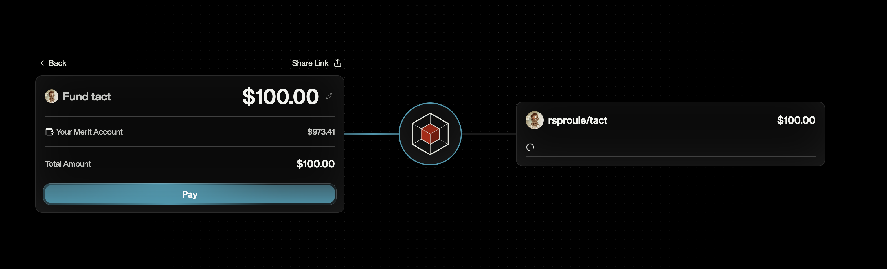

# Tiny Merit

A minimal implementation of a web app interacting with the Merit protocol.

## Concepts

### 1-Pass Payments

Merit Accounts are "counterfactual". This means that they exist before they are even created by the end user. In our context, this means that for every github id (both users and repos), there is already an account that can receive payments without any interaction from the receiving party.

When payments are made through Merit to a GitHub user/repo, there are guarantees that Merit gives the payer that are essentially _bound_ to the payment.

1. Merit guarantees that all requisite tax filings / information is collected for the payee. (fulfilling the payers obligation)
2. Merit guarantees that if the payee does not claim the payment, the payer can reclaim the payment.

We call these 1-pass payments because the payer only needs to do a single 1 pass payment to the person they want to pay. There is no back and forth between the payer and the payee wrangling legal/tax and receiver bank/address information.

### Github IDs

The Merit protocol is designed to do 1-pass payments against any public unique identifier. In our case, we use GitHub's native identifiers and use their Oauth to prove ownership over these identifiers.

GitHub User IDs: unique integer that permanently identifies a user. We prove ownership over these by using classic Oauth.
GitHub Repo IDs: unique integer that permanently identifies a repo. We prove ownership over these by using the GitHub App installation flow [docs](https://docs.github.com/en/apps/creating-github-apps/authenticating-with-a-github-app/about-authentication-with-a-github-app).

## Merit Checkout Links

Merit exposes a dynamic checkout page that allows external applications to construct checkouts for a set of GitHub IDs. So external applications are responsible for collecting the GitHub IDs (directly from github or from their own database) and then constructing a checkout link that can be used to redirect the user to the Merit checkout page.

Example:

I want to pay 2 users and 1 repo:

```
user: 1234567890
amount: 100

user: 9876543210
amount: 100

repo: 5555555555
amount: 100
```

This payment can be constructed as a checkout link using the Merit SDK:

```javascript
import { MeritSDK } from '@merit-systems/sdk'

const sdk = new MeritSDK({
  apiKey: 'your-api-key',
  checkoutURL: 'https://terminal.merit.systems/checkout'
})

const checkoutUrl = sdk.checkout.generateCheckoutUrl({
  items: [
    { type: 'user', id: 1234567890, amount: 100 },
    { type: 'user', id: 9876543210, amount: 100 },
    { type: 'repo', id: 5555555555, amount: 100 }
  ],
  senderGithubId: 24497652 // optional: your GitHub ID
})

// Generated URL will be properly formatted for the Merit checkout page
```

## Merit Checkout Page

This link will open the Merit checkout page to confirm the payment.

<p align="center">
  
</p>

# Tiny Merit Demo

Tiny Merit shows a quick example of how easy it is to setup a checkout link.

Install & run locally:

```
pnpm install
pnpm run dev
```
